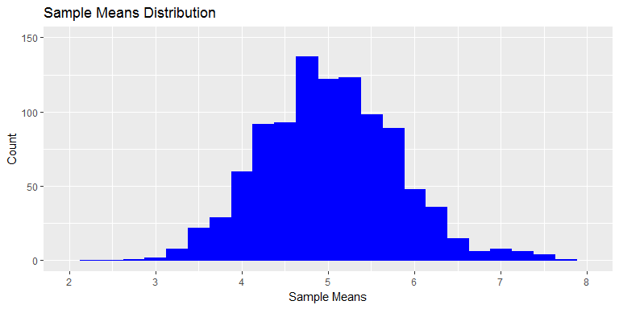
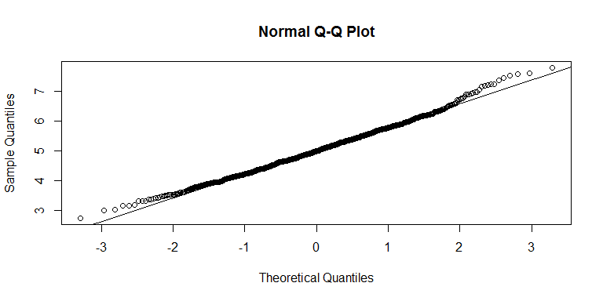

# Statistical Inference Course Project Part 1: Simulation Exercise
David Kochar  
`r Sys.Date()`  

##Overview

This report will investigate the exponential distribution in R and compare it to the Central Limit Theorem. We will investigate the normality of means from multiple, randomly generated exponential means. Accordint to the Central Limit Theorem, We expect the distribution of our randomly generated exponential means to be normal.

## Setup

We will first prepare the workspace environment by setting global options, and installing and loading required libraries.

### Set Global Options

Establish global options for the report output


```r
list.of.packages <- c("knitr")
new.packages <- list.of.packages[!(list.of.packages %in% installed.packages()[,"Package"])]
if(length(new.packages)) install.packages(new.packages, repos = "http://cran.us.r-project.org")
suppressWarnings ( suppressMessages ( library ( knitr ) ) )
knitr::opts_chunk$set(fig.width=8, fig.height=4, fig.path='figures/StatisticalInferenceCourseProject/StatisticalInferenceCourseProjectPart1_', echo=TRUE, warning=FALSE, message=FALSE)
```

### Prepare Workspace and Load Libraries

Clear any existing variables from the workspace, set the working directory, and install required libraries if neccessary


```r
#Clear variables
rm ( list = ls ( all = TRUE ) )
#Get and set working directory
setwd ( getwd ( ) )
#Check installed status of requried packages, and install if necessary
list.of.packages <- c( "ggplot2" )
new.packages <- list.of.packages[!(list.of.packages %in% installed.packages()[,"Package"])]
if(length(new.packages)) install.packages(new.packages, repos = "http://cran.us.r-project.org")
suppressWarnings ( suppressMessages ( library ( ggplot2 ) ) )
```
## Simulations

We first need to simulate multiple exponential distributions, and store the results of our distributions in a matrix. Our simulation will consist of 1,000 trials of a 40 exponential sample. Note that lambda will be set to 0.2.


```r
set.seed ( 123 ) #set seed to ensure reproducibility
l <- 0.2 #set lambda
n <- 40 #number of exponetials to simulate
trials <- 1000 #number of trials to perform
ExpMatrix <- as.data.frame ( matrix ( rexp ( n * trials, rate = l ), trials, n ) ) #Create a dataframe of the trials
```
## Calculate the Simulations Means

For each of our trials, we will calculate the mean of the sample.


```r
ExpMatrixMeans <- data.frame ( ExpMeans = apply ( ExpMatrix, 1, mean) ) #Create a dataframe of trial means
```
##Sample Mean Versus Theoretical Mean

Let's compare the behavior of our sample means to the theoretical mean of the exponential distribution.

###Distribution of Sample Means

Let's plot the distribution of the means from each of our simulations.


```r
ggplot (data = ExpMatrixMeans, aes (x = ExpMeans)) +
  geom_histogram (binwidth = 0.25,
  fill = "blue",
  colour = "blue") +
  labs(title = "Sample Means Distribution", x = "Sample Means", y = "Count") +
  scale_x_continuous (limits = c(floor (min (
  ExpMatrixMeans$ExpMeans
  )), ceiling (max (
  ExpMatrixMeans$ExpMeans
  ))),
  breaks = seq (0, ceiling (max (
  ExpMatrixMeans$ExpMeans
  )), 1)) +
  scale_y_continuous (limits = c (0, 150))
```

<!-- -->

As we can see, the distribution of the sample means from our simulations closely resembles a normal distribution - the distribution is unimodal and symmetric. This behavior is expected according to the Central Limit Theorem. Thus, even though exponential distributions are not normal, the distribution of means from many exponential distributions are normal.

Let's assess the normality of our sample means distribution via a normal probability plot.


```r
qqnorm(ExpMatrixMeans$ExpMeans) #plot the q-q plot
qqline(ExpMatrixMeans$ExpMeans) #plot the normality line
```

<!-- -->

Again we can see very normal behavior from our sample means, as our sample means distribution closely fits the normal, theoretical quantile modeled line.

###Comparison of the Distribution centers

Let's compare distribution centers between our theoretical mean and our sample means.


```r
TheoreticalMean <- 1 / l #The theoretical mean is 1 / lambda 
TrialsMean <- round ( mean ( ExpMatrixMeans$ExpMeans ), 2 ) #Compute the mean of sample means from the simulated trials
```

Our theoretical mean is 5, and the mean of our sample means is 5.01. Since these means are very close, we demonstrate the center of means from our multiple trials is virtually the same as the theoretical mean. This behavior is also expected according to the Central Limit Theorem.

##Sample Variance Versus Theoretical Variance

To assess the sample Variance versus the theoretical variance, Let's compare the standard deviations of our sample means to the theoretical standard deviation


```r
TheoreticalSD <- ( 1 / l ) / sqrt ( n ) #The theoretical standard deviation is ( 1 / l ) / sqrt ( n )
TrialsSD <- sd ( ExpMatrixMeans$ExpMeans ) #calculate the standard deviation of the sample means
```

Our theoretical standard deviation of the sample means is 0.7905694, and the standard deviation of our sample means is 0.7802751. Yet again, this behavior is expected according to the Central Limit Theorem - the variance of our sample means should be virtually identital to the theoretical standard deviation of the sample.
