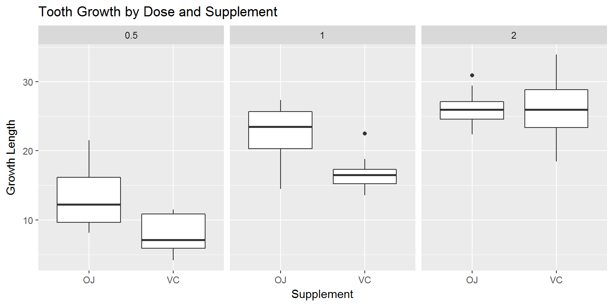

# Statistical Inference Course Project Part 2: Basic Inferential Data Analysis
David Kochar  
`r Sys.Date()`  

##Overview

This report will perform exploratory data analysis from R's "ToothGrowth" data set, and also use hypothesis testing to compare tooth growth by supplement type and dose. 

## Setup

We will first prepare the workspace environment by setting global options, and installing and loading required libraries.

### Set Global Options

Establish global options for the report output


```r
list.of.packages <- c("knitr")
new.packages <- list.of.packages[!(list.of.packages %in% installed.packages()[,"Package"])]
if(length(new.packages)) install.packages(new.packages, repos = "http://cran.us.r-project.org")
suppressWarnings ( suppressMessages ( library ( knitr ) ) )
knitr::opts_chunk$set(fig.width=8, fig.height=4, fig.path='figures/StatisticalInferenceCourseProject/StatisticalInferenceCourseProjectPart1_', echo=TRUE, warning=FALSE, message=FALSE)
```

### Prepare Workspace and Load Libraries

Clear any existing variables from the workspace, set the working directory, and install required libraries if neccessary


```r
#Clear variables
rm ( list = ls ( all = TRUE ) )
#Get and set working directory
setwd ( getwd ( ) )
#Check installed status of requried packages, and install if necessary
list.of.packages <- c( "ggplot2", "dplyr", "kableExtra" )
new.packages <- list.of.packages[!(list.of.packages %in% installed.packages()[,"Package"])]
if(length(new.packages)) install.packages(new.packages, repos = "http://cran.us.r-project.org")
suppressWarnings ( suppressMessages ( library ( ggplot2 ) ) )
suppressWarnings ( suppressMessages ( library ( dplyr ) ) )
suppressWarnings ( suppressMessages ( library ( kableExtra ) ) )
```
### Load Data

```r
data ( ToothGrowth ) #load the ToothGrowth data set
```

##Exploratory Data Analysis

Let's get a feel for our data set by determining the data types and any factor levels


```r
str ( ToothGrowth ) #load the ToothGrowth data set
```

```
## 'data.frame':	60 obs. of  3 variables:
##  $ len : num  4.2 11.5 7.3 5.8 6.4 10 11.2 11.2 5.2 7 ...
##  $ supp: Factor w/ 2 levels "OJ","VC": 2 2 2 2 2 2 2 2 2 2 ...
##  $ dose: num  0.5 0.5 0.5 0.5 0.5 0.5 0.5 0.5 0.5 0.5 ...
```
It appears that "dose" is actually a categorical variable in this context. Let's determine if the values are discrete.


```r
unique ( ToothGrowth$dose ) #find unique does values
```

```
## [1] 0.5 1.0 2.0
```

The variable "dose" is indeed categorical in this context, as it has three distinct values.

Let's compare the distributions growth by supplement and dose


```r
ggplot(aes(x = supp, y = len), data = ToothGrowth) +
  geom_boxplot() +
  facet_wrap(~ dose) +
  labs(title = "Tooth Growth by Dose and Supplement", x = "Supplement", y = "Growth Length")
```

<!-- -->

Growth appears to increase as the dosage increases, and the OJ supplement appears more effective in doeses of 0.5 and 1. The variability in the OJ supplement appears to decrease as the dosage increase, but variability for the VC supplement is reduces only for doses of 1.

Let's summarise the data by supplement and dose


```r
ToothGrowthSummary <- ToothGrowth %>%
  group_by (supp, dose) %>%
  summarise (
  MinGrowth = min(len),
  MaxGrowth = max(len),
  AverageGrowth = mean(len),
  MedianGrowth = median(len),
  GrowthIQR = IQR(len)
  ) %>%
  arrange (dose, supp)
  
  ToothGrowthSummary %>%
  kable("html") %>%
  kable_styling()
```

<table class="table" style="margin-left: auto; margin-right: auto;">
<thead><tr>
<th style="text-align:left;"> supp </th>
   <th style="text-align:right;"> dose </th>
   <th style="text-align:right;"> MinGrowth </th>
   <th style="text-align:right;"> MaxGrowth </th>
   <th style="text-align:right;"> AverageGrowth </th>
   <th style="text-align:right;"> MedianGrowth </th>
   <th style="text-align:right;"> GrowthIQR </th>
  </tr></thead>
<tbody>
<tr>
<td style="text-align:left;"> OJ </td>
   <td style="text-align:right;"> 0.5 </td>
   <td style="text-align:right;"> 8.2 </td>
   <td style="text-align:right;"> 21.5 </td>
   <td style="text-align:right;"> 13.23 </td>
   <td style="text-align:right;"> 12.25 </td>
   <td style="text-align:right;"> 6.475 </td>
  </tr>
<tr>
<td style="text-align:left;"> VC </td>
   <td style="text-align:right;"> 0.5 </td>
   <td style="text-align:right;"> 4.2 </td>
   <td style="text-align:right;"> 11.5 </td>
   <td style="text-align:right;"> 7.98 </td>
   <td style="text-align:right;"> 7.15 </td>
   <td style="text-align:right;"> 4.950 </td>
  </tr>
<tr>
<td style="text-align:left;"> OJ </td>
   <td style="text-align:right;"> 1.0 </td>
   <td style="text-align:right;"> 14.5 </td>
   <td style="text-align:right;"> 27.3 </td>
   <td style="text-align:right;"> 22.70 </td>
   <td style="text-align:right;"> 23.45 </td>
   <td style="text-align:right;"> 5.350 </td>
  </tr>
<tr>
<td style="text-align:left;"> VC </td>
   <td style="text-align:right;"> 1.0 </td>
   <td style="text-align:right;"> 13.6 </td>
   <td style="text-align:right;"> 22.5 </td>
   <td style="text-align:right;"> 16.77 </td>
   <td style="text-align:right;"> 16.50 </td>
   <td style="text-align:right;"> 2.025 </td>
  </tr>
<tr>
<td style="text-align:left;"> OJ </td>
   <td style="text-align:right;"> 2.0 </td>
   <td style="text-align:right;"> 22.4 </td>
   <td style="text-align:right;"> 30.9 </td>
   <td style="text-align:right;"> 26.06 </td>
   <td style="text-align:right;"> 25.95 </td>
   <td style="text-align:right;"> 2.500 </td>
  </tr>
<tr>
<td style="text-align:left;"> VC </td>
   <td style="text-align:right;"> 2.0 </td>
   <td style="text-align:right;"> 18.5 </td>
   <td style="text-align:right;"> 33.9 </td>
   <td style="text-align:right;"> 26.14 </td>
   <td style="text-align:right;"> 25.95 </td>
   <td style="text-align:right;"> 5.425 </td>
  </tr>
</tbody>
</table>

As we visually suspected, our summary shows growth increases as dosage increases, and the OJ supplement shows apparently more significant mean growth in the 0.5 and 1.0 doses.
